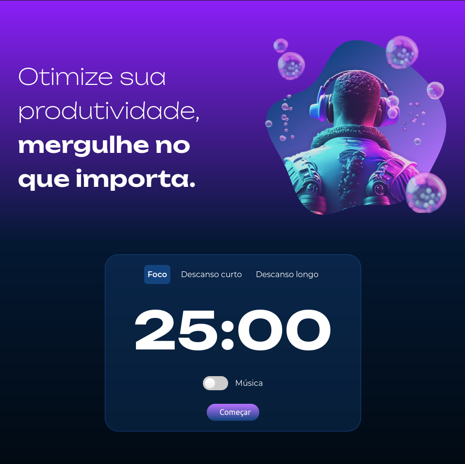

# Projeto Fokus

O Fokus é uma plataforma Pomodoro, projetada para manter sua concentração por longos períodos durante o trabalho, os estudos e em tudo o que verdadeiramente importa.

## 🔨 Funcionalidades do projeto

O Fokus oferece uma função de foco que mantém você concentrado por 25 minutos, seguida por um breve intervalo de 5 minutos para hidratação e alongamento. Além disso, disponibiliza um intervalo longo de 15 minutos, e ainda oferece a opção de ouvir música especialmente selecionada para manter seu foco.

## ✔️ Técnicas e tecnologias utilizadas

- `HTML`: O HTML tem um papel fundamental para a estruturação do projeto;
- `CSS`: O CSS tem papel fundamental para deixa a pagina com uma aparencia muito bonita;
- `JavaScript`: O JavaScript proporcionará as funções utilizadas no projeto como o foco, descanso curto, descanso longo, a música além do proprio timer. Abaixo alguns tecnologias utilixadas no projeto:
  - `querySelector`;
  - `document`;
  - `const`;
  - `function`;
  - `switch`;
  - `for`;
  - `if`;
  - `else`;
  - `template string`;
  - `EventListener`;

## 📚 Mais informações do curso

Busque na plataforma da <a src="https://www.alura.com.br/">Alura</a> o curso **JavaScript: manipulando elementos no DOM** publicado na Escola Frontend.
